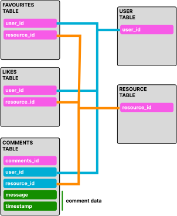
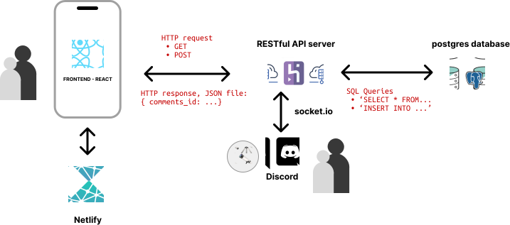
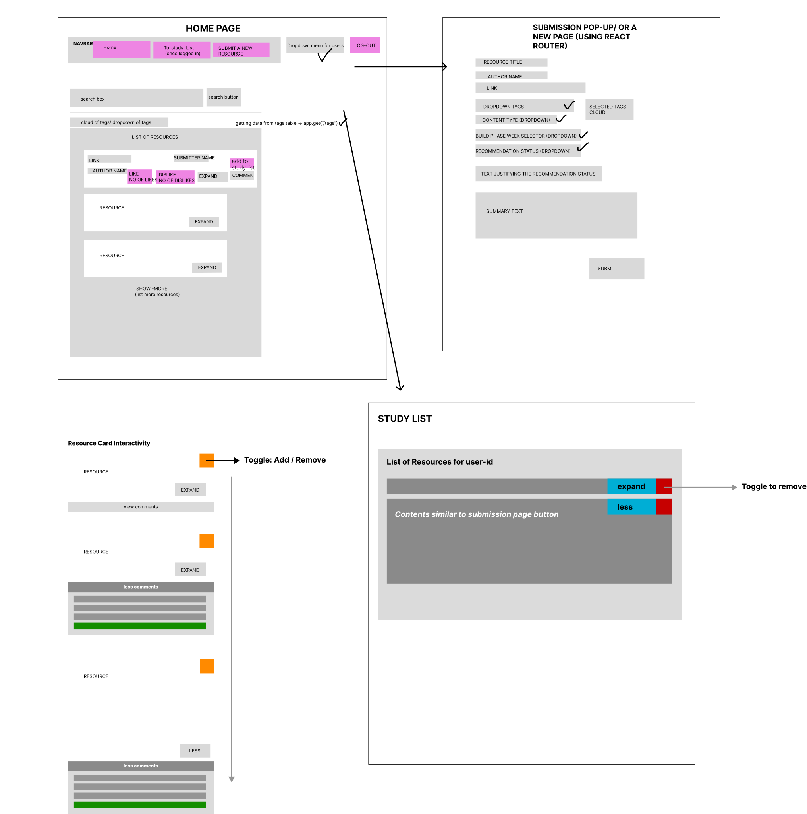
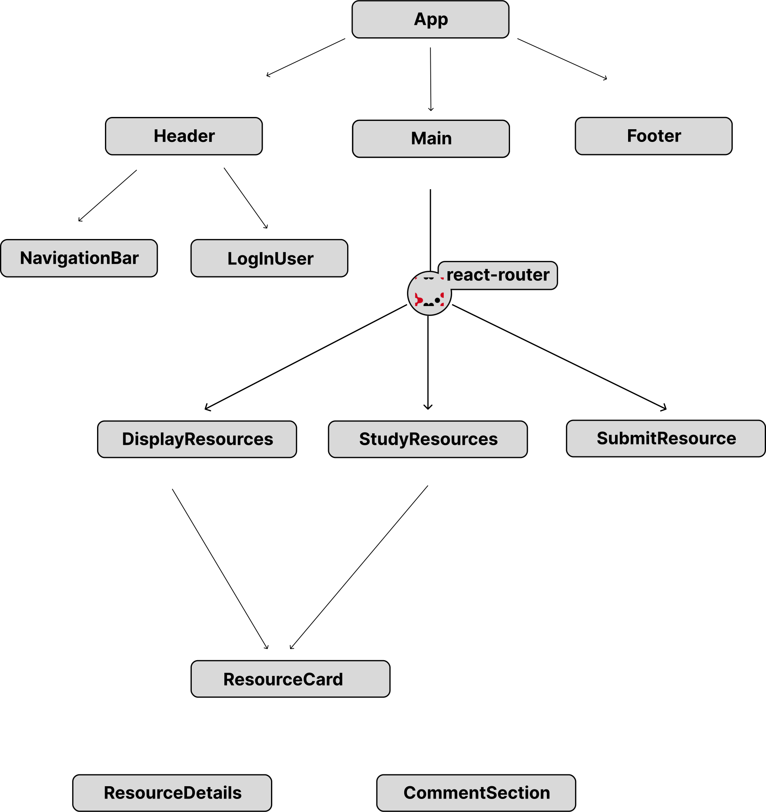

# Study Resources App

⚠️ This team project is archived, but you can access the code and the development approach below ⚠️   

This is a full-stack application using:

        

⚠️ The backend may take 3-5 minutes to warm up and may not have any resources to present ⚠️   

This repository is the front-end which is [deployed on netlify](https://bhawick-study-resource-catalogueue.netlify.app/).

The [backend repository](https://bhawick-study-resource-catalogueue.netlify.app/) which is deployed on Railway  was originally Heroku at the time of development.

## Overview

This a small full-stack application which allows a student to collaboratively submit and explore a shared catalogue of useful study resources (articles, exercise sets, youtube videos, tools, ebooks and podcasts).

### Features

The following features have been implemented in the application.

When a user visits the app:
- [x] They can see recommendations
- [x] They can find more recommendations:
- [x] They can search resources to find those that contain a given string in the name, description, tags, or author.
- [x] They can filter by tag to find all resources which have that tag
- [x] They can simulate signing in by selecting their name from a drop-down

When a user visits the app:
- [x] They can add a new resource recommendation (see "what's in a resource recommendation?")
- [x] If the resource they are recommending is already in the database, a duplicate should NOT be registered, rather:
	- [x] They can give a like or dislike (along with a comment, in each case) to a resource already in the db.
- [x] They can add or remove a resource from their “to-study” list.
- [x] They can view their “to-study” list.
- [x] They can simulate signing out by clicking an appropriate button or link

### CI/CD and Automated Testing

The project uses [Cypress](https://www.cypress.io/) and [Jest](https://jestjs.io/), along side [Github Actions](https://github.com/features/actions) to perform integration and unit tests.

Deployment is performed automatically either on Netlify or [Railway](https://railway.app/) (previously [Heroku](https://github.com/features/actions)) when a pull request is merged into main.

⚠️ for optimum constrast for image viewing, use `light mode` ⚠️   

### Database Design

### Application Architectural Diagram

### UI Wireframe

### React Component Breakdown

### Technical Presentation
We also held a presentation to provide an overview of how the full-stack app work behind the scenes [[link](https://docs.google.com/presentation/d/e/2PACX-1vTmVXJK8LDLYhjxsAiHCeQpqnghb8rR6fj6D7j8iM-G4Kg5vG_G3c9aVExLF8jEwql1AqBYoJXkSHV8/pub?start=false&loop=false&delayms=3000)]
